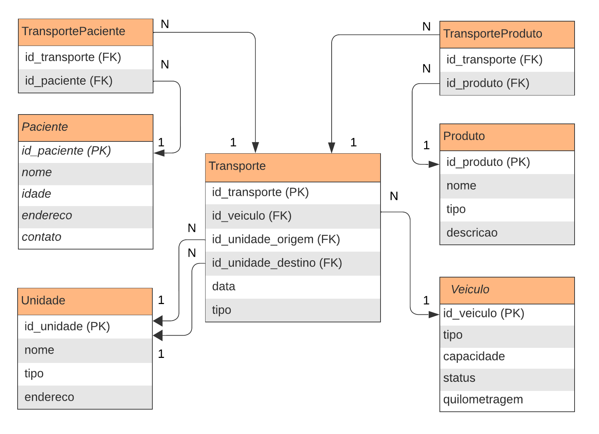

# ponderada-m6-s3.2

Para iniciar a atividade, é essencial a criação de um modelo de entidade e relacionamento. Segue a baixo o modelo lógico desenvolvido:

 
#### Visão Geral do Modelo

O modelo lógico apresentado foi desenvolvido para suportar um sistema de transporte relacionado à saúde, facilitando a gestão de pacientes, produtos médicos, e veículos. O sistema tem como objetivo otimizar a entrega de produtos médicos e o transporte de pacientes para unidades de saúde, além de gerenciar a frota de veículos envolvida nessas operações.

## Entidades Principais
O modelo inclui cinco entidades principais:

**Paciente:** Armazena informações sobre os pacientes.
**Produto:** Registra os produtos médicos transportados,.
**Veículo:** Detalha os veículos usados no transporte.
**Unidade:** Representa as unidades de saúde, onde os pacientes são transportados ou de onde os produtos são enviados ou entregues.
**Transporte:** Central para o sistema, essa entidade vincula veículos, produtos e pacientes às unidades de origem e destino, incluindo a data e o tipo de transporte.

## Relacionamentos

Transporte está no centro do modelo, relacionando-se com Veículos, Unidades, Pacientes e Produtos. Cada transporte pode envolver múltiplos pacientes e produtos, refletido pelas tabelas de associação TransportePaciente e TransporteProduto.

TransportePaciente e TransporteProduto são tabelas de junção que facilitam a gestão de muitos para muitos entre transportes e pacientes/produtos, respectivamente.

---

Através das entidades e relacionamentos estabelecidos, o sistema está bem equipado para melhorar a eficiência e a eficácia da entrega de serviços de saúde, garantindo que os recursos são alocados de maneira otimizada e que os pacientes recebem cuidados no tempo certo.