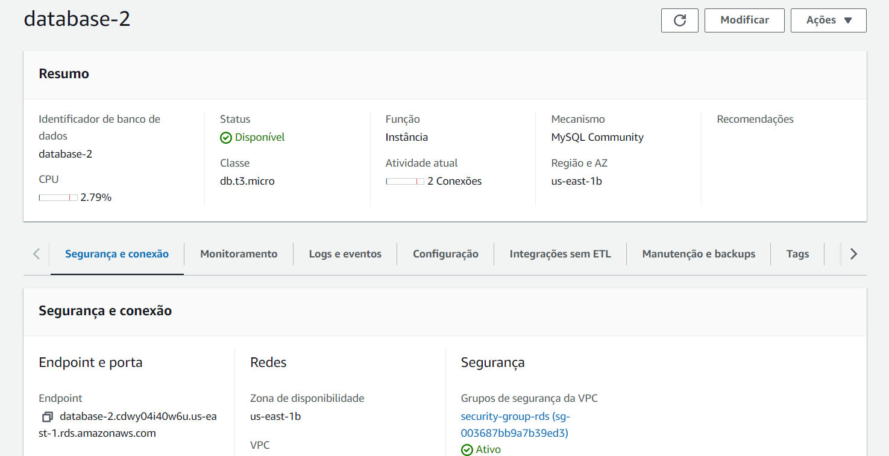
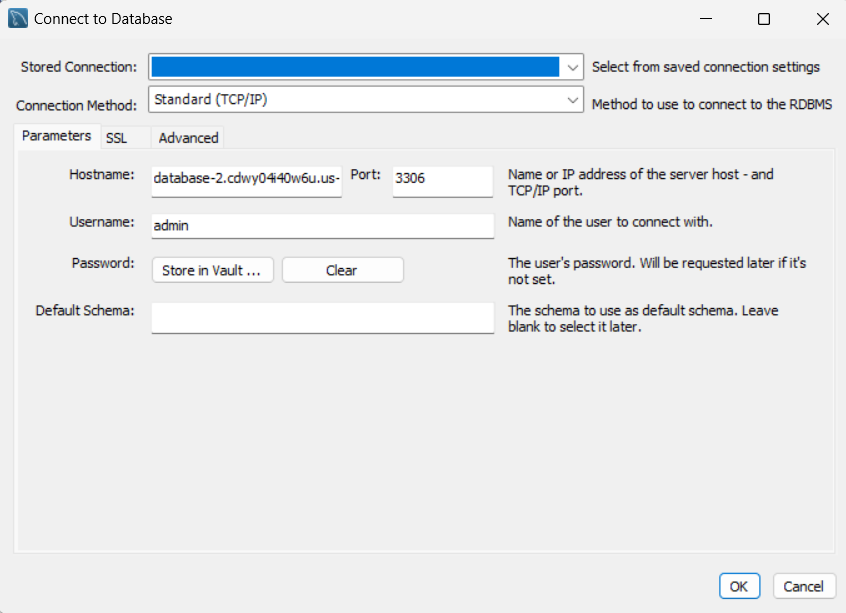
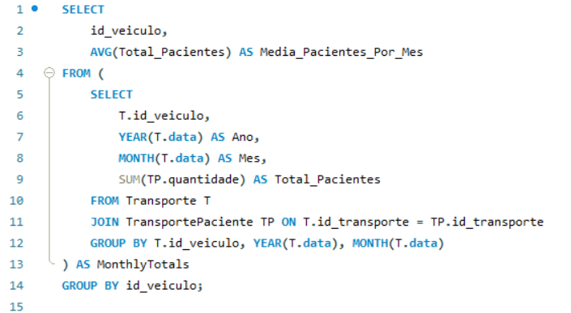
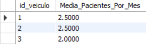

# Projeto de Banco de Dados RDS

Para iniciar a atividade, é essencial a criação de um modelo de entidade e relacionamento. Segue a baixo o modelo lógico desenvolvido:

 
## 1. Modelo Lógico

O modelo lógico apresentado foi desenvolvido para suportar um sistema de transporte relacionado à saúde, facilitando a gestão de pacientes, produtos médicos, e veículos. O sistema tem como objetivo otimizar a entrega de produtos médicos e o transporte de pacientes para unidades de saúde, além de gerenciar a frota de veículos envolvida nessas operações.

#### Entidades Principais
O modelo inclui cinco entidades principais:

**Paciente:** Armazena informações sobre os pacientes.

**Produto:** Registra os produtos médicos transportados.

**Veículo:** Detalha os veículos usados no transporte.

**Unidade:** Representa as unidades de saúde, onde os pacientes são transportados ou de onde os produtos são enviados ou entregues.

**Transporte:** Central para o sistema, essa entidade vincula veículos, produtos e pacientes às unidades de origem e destino, incluindo a data e o tipo de transporte.

#### Relacionamentos

Transporte está no centro do modelo, relacionando-se com Veículos, Unidades, Pacientes e Produtos. Cada transporte pode envolver múltiplos pacientes e produtos, refletido pelas tabelas de associação TransportePaciente e TransporteProduto.

TransportePaciente e TransporteProduto são tabelas de junção que facilitam a gestão de muitos para muitos entre transportes e pacientes/produtos, respectivamente.

---

Através das entidades e relacionamentos estabelecidos, o sistema está bem equipado para melhorar a eficiência e a eficácia da entrega de serviços de saúde, garantindo que os recursos são alocados de maneira otimizada e que os pacientes recebem cuidados no tempo certo.

## 2. Banco de Dados no AWS RDS

 O Amazon RDS é um serviço de banco de dados relacional gerenciado que facilita a configuração, operação e escalabilidade de um banco de dados relacional na nuvem. Ele oferece uma capacidade econômica e redimensionável enquanto gerencia tarefas de administração de banco de dados. Segue abaixo uma imagem da instância criada para essa atividade:

 

Algumas informações-chave sobre esse banco de dados incluem:

- Endpoint: `database-2.cdwy04i40w6u.us-east-1.rds.amazonaws.com` é o endereço através do qual as aplicações podem se conectar ao banco de dados.

- Porta: Geralmente, MySQL usa a porta `3306`, que é padrão e deve ser aberta no grupo de segurança para permitir tráfego.

Este setup no Amazon RDS facilita o gerenciamento eficiente do banco de dados, permitindo a concentração mais no desenvolvimento de aplicações e menos na administração de infraestrutura de banco de dados.

## 3. Conexão com MYSQL Workbench

MySQL Workbench é uma ferramenta essencial para o gerenciamento de bancos de dados MySQL, oferecendo funcionalidades abrangentes de modelagem, desenvolvimento e administração. No contexto dessa atividade, o MySQL Workbench foi utilizado para facilitar várias etapas críticas do gerenciamento do banco de dados hospedado no Amazon RDS.

- **Criação de Tabelas**

O projeto requeria a implementação de uma estrutura de banco de dados robusta para suportar o gerenciamento de pacientes, veículos e transportes. Utilizando o MySQL Workbench, as tabelas foram definidas para refletir as necessidades do sistema:

**Paciente:** Armazena informações detalhadas sobre os pacientes.

**Veiculo:** Contém dados sobre os veículos utilizados nos transportes.

**Transporte:** Registra cada transporte realizado, vinculando veículos a datas e tipos de transporte.

**TransportePaciente:** Associa transportes a pacientes e registra quantidades transportadas.

Essas tabelas foram criadas mediante scripts SQL executados diretamente no MySQL Workbench, garantindo precisão na definição dos esquemas e eficiência no processo de implementação.

- **Inserção de Dados**

Para testar a funcionalidade do sistema e realizar análises preliminares, dados de exemplo foram inseridos nas tabelas criadas. O MySQL Workbench facilitou esse processo, permitindo a execução rápida de scripts de inserção que popularam as tabelas com dados representativos, essenciais para as fases subsequentes de teste e validação do sistema.

- **Execução de Consultas**

A análise dos dados é crucial para a avaliação da eficácia do sistema de transporte. Utilizou-se o MySQL Workbench para executar consultas complexas, particularmente para calcular a média mensal de pacientes transportados por cada veículo. Este cálculo foi realizado através da consulta SQL abaixo, que agrupava os dados por veículo e por mês, aplicando funções de agregação para determinar as médias.

Como resultado, obtivemos a seguinte resposta:

## 4. Conclusão
O MySQL Workbench provou ser uma ferramenta indispensável no gerenciamento e análise do banco de dados do nosso projeto. Através de sua utilização, foi possível implementar uma estrutura de banco de dados eficiente, realizar inserções de dados de forma controlada, e executar consultas analíticas para informar decisões operacionais e estratégicas.

